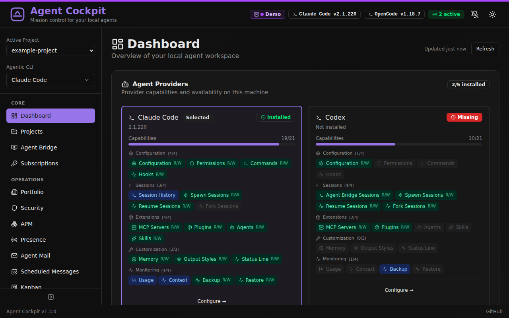
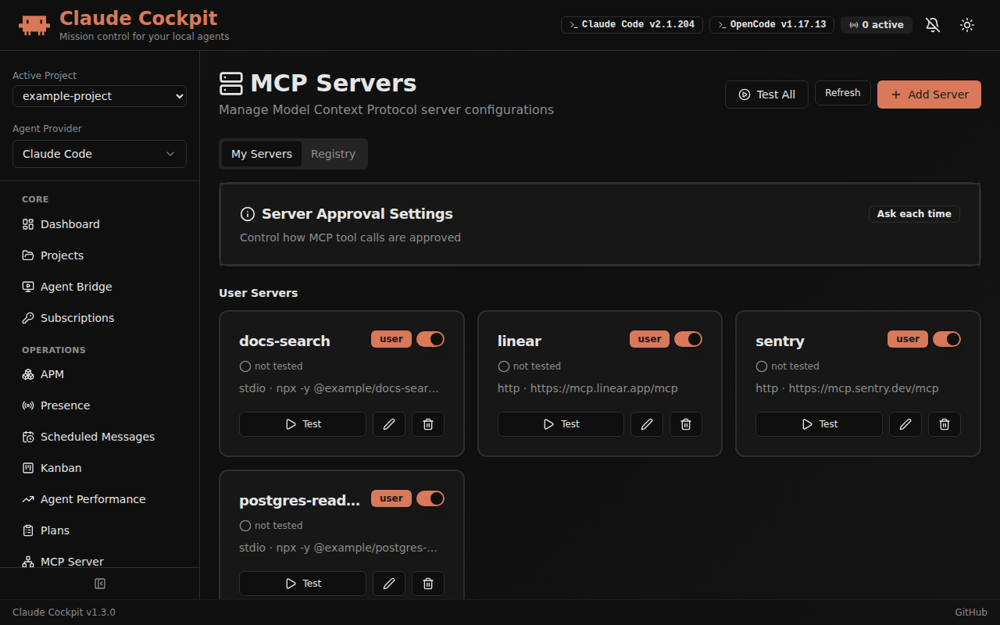
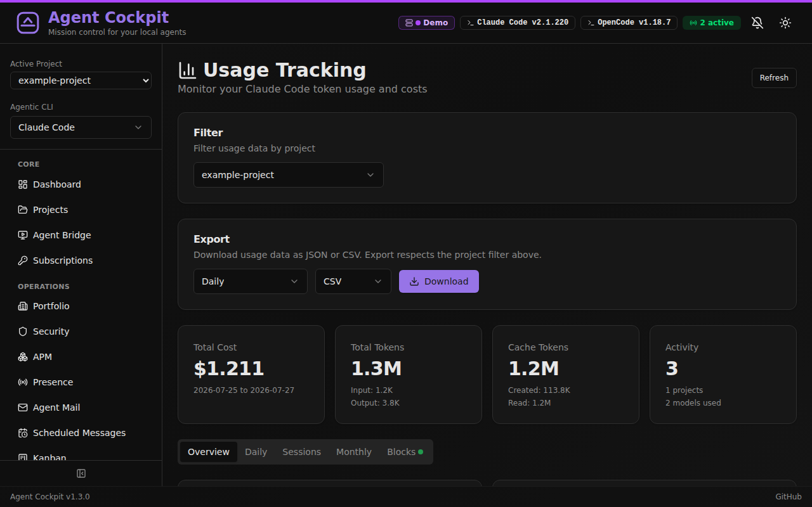
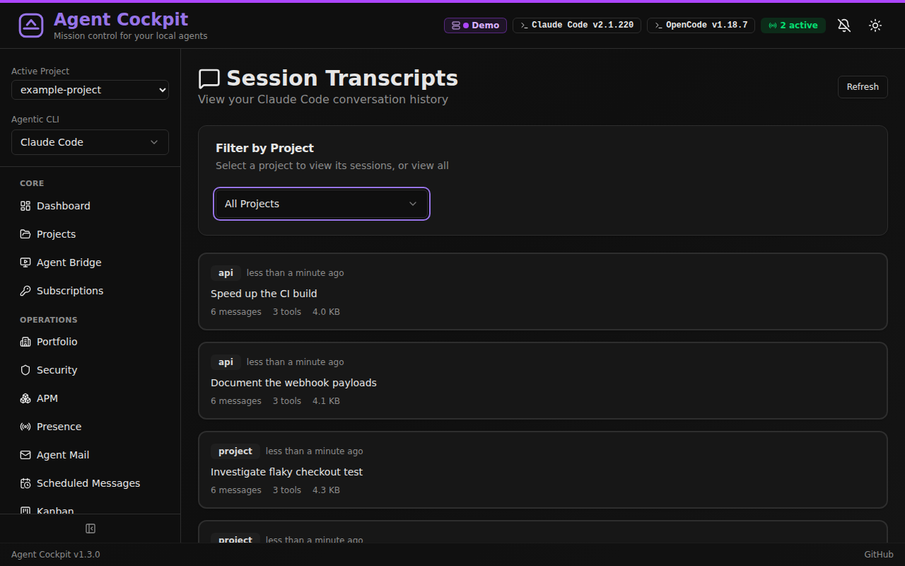
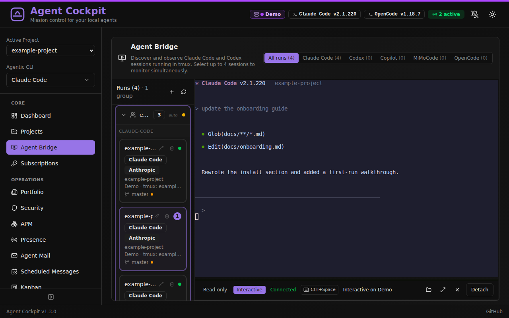
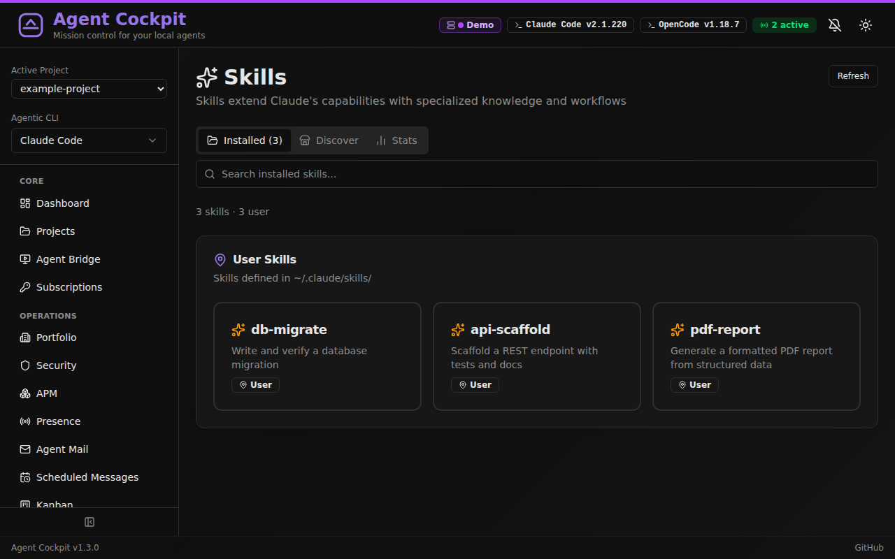

# Claude Cockpit

[](https://github.com/guillaumevandevelde/claude-cockpit/actions/workflows/quality.yml)
[](https://github.com/guillaumevandevelde/claude-cockpit/actions/workflows/security.yml)

A self-hosted web application for visualizing and managing local AI coding agents. Provides a unified interface for Claude Code configuration, Codex CLI configuration, MCP servers, plugins, slash commands, hooks, agents, permissions, usage tracking, session transcripts, Agent Bridge, and other local agent extensions.

## Credits — Forked from claude-deck

Claude Cockpit is a fork of [**claude-deck**](https://github.com/adrirubio/claude-deck) by Adrian Rubio-Punal and Juan A. Rubio, used under the MIT License. Their original copyright and license are retained in [`LICENSE`](./LICENSE). Claude Cockpit adds a scheduled-messages feature (timer/cron → tmux injection) on top of their work.

## Why This Exists

Claude Code starts simple, then slowly sprawls across config files and directories: `~/.claude.json`, `~/.claude/settings.json`, `.mcp.json`, slash commands, agents, skills, project settings, transcripts, and usage data. That works fine at small scale, but once your setup gets serious it becomes hard to see the whole picture, change things confidently, or understand what is actually configured.

Claude Cockpit gives you one local interface for that sprawl. It also has provider-aware Codex CLI support for tmux sessions, safe TOML configuration, feature flags, diagnostics, MCP/plugin inventory and supported CLI-backed mutations, and redacted export-only backups.

## Best For

Claude Cockpit is best for people running multiple Claude Code or Codex CLI sessions, MCP servers, custom commands, hooks, agents, or tracking Claude Code usage across sessions.

If you only use Claude Code casually with mostly default config, Claude Cockpit may be overkill.

## Trust Model

- **Local only** — no cloud
- **No account** — nothing to sign up for
- **No telemetry** — no usage tracking sent anywhere
- **Works with your real files** — reads and writes existing Claude Code and Codex config files

> [!WARNING]
> Claude Cockpit reads and writes your real local agent configuration files. Changes made in the UI affect the files Claude Code and Codex CLI actually use. Review changes carefully, and create a backup before major edits.

## Features

- **Dashboard** — Overview of local agent configuration with Claude Code context window visualizer
- **Provider Switcher** — Move between Claude Code and Codex CLI surfaces without leaving the app
- **Config Editor** — Browse, inspect, and edit Claude Code JSON settings or Codex TOML settings, including Codex profiles, runtime options, and feature flags
- **MCP Servers** — Add, edit, test, and manage MCP server connections with OAuth support. Browse and install servers from the [MCP Registry](https://registry.modelcontextprotocol.io). View tools, resources, and prompts. Supports stdio, HTTP, and SSE transports
- **Slash Commands** — Browse, create, and edit custom commands (user and project scope)
- **Plugins** — Browse installed plugins with detail views and enable/disable toggles; Codex plugins support CLI-backed inventory, install, and remove where the installed Codex CLI exposes safe commands
- **Hooks** — Configure automation hooks by event type (PreToolUse, PostToolUse, etc.)
- **Permissions** — Visual allow/deny rule builder for tool access control
- **Agents** — Create and manage custom agent configurations
- **Skills** — Browse installed skills and discover new ones from [skills.sh](https://skills.sh)
- **Memory** — View and edit Claude Code memory files
- **Output Styles** — Configure response output formats
- **Status Line** — Customize Claude Code status line display
- **Agent Bridge** — Discover and monitor Claude Code and Codex CLI sessions running in tmux. Attach up to 4 terminals simultaneously in a 2x2 grid with independent read-only/interactive modes, fullscreen toggle, and per-pane controls. Spawn new sessions and manage provider-specific options directly from the UI
- **Session Transcripts** — View conversation history with full message details and tool use
- **Usage Tracking** — Monitor token usage, costs, and billing blocks with daily/monthly charts
- **Plan History** — Browse and review Claude Code implementation plans
- **Backup & Restore** — Create and manage Claude Code backups with selective restore, plus redacted export-only Codex backups
- **Projects** — Discover and manage project directories
- **Sandcastle** — Run AI coding agents in isolated sandboxes (Docker, Podman, Vercel) with [sandcastle](https://github.com/mattpocock/sandcastle). Supports parallel execution, kanban integration, scheduled messages, and real-time log streaming

## What's New for the Next Release

Codex CLI support has moved from experimental plumbing to a usable provider surface:

- Provider-aware Agent Bridge can discover, spawn, resume, fork, attach to, and kill Codex tmux sessions.
- The Codex config editor now handles safe TOML settings, profiles, runtime controls, and feature flags from `codex features list`.
- Codex settings include dropdowns for known enum values and help tooltips for settings and feature flags where official descriptions are available.
- Codex MCP and plugin inventory are visible, with supported CLI-backed add/remove or install/remove actions.
- Codex exports are redacted and export-only by design.
- Project discovery is now easier from the UI, including directory browsing when adding projects.

Codex support is explicit about provider boundaries: usage/context parity and session transcript browsing are not supported for Codex yet; history and model-cache diagnostics avoid prompt text and raw cache payloads; Codex automatic restore is refused because exports intentionally exclude auth, history, cache, and local state.

## Screenshots

| Dashboard | MCP Servers |
|-----------|-------------|
|  |  |
| High-level overview of your Claude Code setup | Manage MCP connections, status, and configuration |

| Usage Tracking | Session Transcripts |
|----------------|---------------------|
|  |  |
| Cost visibility, charts, and billing blocks | Browse conversation history and tool usage details |

| Agent Bridge | Skills |
|-----------|--------|
|  |  |
| Monitor and interact with Claude Code and Codex tmux sessions | Browse installed skills and discover new ones |

## Tech Stack

| Layer | Technology |
|-------|------------|
| Backend | Python 3.11+ with FastAPI |
| Frontend | React 19 + TypeScript 6 + Vite 7 |
| UI Components | shadcn/ui + Tailwind CSS |
| Charts | Recharts (via shadcn/ui) |
| Database | SQLite (async via SQLAlchemy + aiosqlite) |
| Containerization | Docker + Docker Compose |

## Quick Start with Docker

```bash
git clone git@github.com:guillaumevandevelde/claude-cockpit.git
cd claude-cockpit
docker compose up
```

This builds and starts Claude Cockpit at http://localhost:8000, mounting your `~/.claude` directory and `~/.claude.json` configuration file. Codex support reads `$CODEX_HOME`, defaulting to `~/.codex`, when available in the runtime environment.

> [!WARNING]
> Claude Cockpit is not a mock viewer. It works with your real local agent files, so changes made in the UI can change your working setup.

> [!NOTE]
> The container mounts your home directory's Claude Code configuration. The container runs as root to access these files; adjust permissions if running as a non-root user.

## Manual Installation

**Prerequisites**: Python 3.11+, Node.js 18+

```bash
git clone git@github.com:guillaumevandevelde/claude-cockpit.git
cd claude-cockpit
./scripts/install.sh
```

## Development

**Recommended — supervised background:**

```bash
./scripts/cockpit.sh start          # Start, auto-install deps if needed, detach
./scripts/cockpit.sh logs backend   # Follow backend logs (or: logs frontend)
./scripts/cockpit.sh status         # Show service status
./scripts/cockpit.sh restart        # Restart after config changes
./scripts/cockpit.sh stop           # Stop everything
```

The supervisor auto-restarts crashed services and automatically runs `npm install` or `pip install` when `package-lock.json` or `requirements-dev.txt` change. It also survives terminal close.

**Alternative — attached mode:**

```bash
./scripts/dev.sh
```

All output appears directly in the terminal; Ctrl+C stops both servers. Useful for debugging startup issues. Requires deps to be installed first (`./scripts/install.sh` or a prior `cockpit.sh start`).

Both approaches start:
- Backend at http://localhost:8000 (API docs at http://localhost:8000/docs)
- Frontend at http://localhost:5173

To make the dev environment reachable from another machine on your LAN or tailnet, set an API token and pass `--host`:

```bash
API_TOKEN='replace-with-a-long-random-value' ./scripts/cockpit.sh start --host 0.0.0.0
# or
API_TOKEN='replace-with-a-long-random-value' ./scripts/dev.sh --host 0.0.0.0
```

Both servers will then bind to all interfaces. The browser asks for the API token on its first protected request and keeps it in session storage. Configure `CORS_ORIGINS` explicitly when using a reverse proxy or a different frontend origin.

To preview the documentation site:

```bash
./scripts/docs-dev.sh
```

This starts VitePress at http://localhost:5174/docs/. Use `--host 0.0.0.0` if you need to reach it from another machine.

For a release check, `./scripts/build.sh` builds both the app frontend and the documentation site.

## Configuration Files

Claude Cockpit reads and writes these Claude Code configuration files:

| File/Directory | Scope | Description |
|---------------|-------|-------------|
| `~/.claude.json` | User | OAuth, caches, MCP servers |
| `~/.claude/settings.json` | User | User settings, permissions, disabled servers |
| `~/.claude/settings.local.json` | User | Local overrides (not committed) |
| `~/.claude/commands/` | User | User slash commands |
| `~/.claude/agents/` | User | User agents |
| `~/.claude/skills/` | User | User skills |
| `~/.claude/projects/` | User | Session transcripts & usage data |
| `.claude/settings.json` | Project | Project settings |
| `.claude/commands/` | Project | Project slash commands |
| `.mcp.json` | Project | Project MCP servers |
| `CLAUDE.md` | Project | Project instructions |

Codex CLI support uses `$CODEX_HOME`, defaulting to `~/.codex`:

| File/Directory | Scope | Description |
|---------------|-------|-------------|
| `~/.codex/config.toml` | User | Main Codex TOML configuration |
| `~/.codex/*.config.toml` | User | Codex profile v2 files |
| `~/.codex/rules/` | User | Codex rule files |
| `~/.codex/auth.json` | User | Auth status only; raw contents are never returned |

## Contributing

See [CONTRIBUTING.md](CONTRIBUTING.md) for setup, style, and PR guidelines.

API documentation is available at http://localhost:8000/docs when running the dev server.

## Feedback

If you use Claude Code heavily, issues and feature requests are especially welcome.

## Built By

[Adrian](https://github.com/adrirubio) (13) and [Juan](https://github.com/juanrubio) during the 2025 Christmas break as a learning project — to explore open source, Claude Code, and full-stack development together.

## Acknowledgments

The session transcript viewer was inspired by and includes code adapted from [claude-code-transcripts](https://github.com/simonw/claude-code-transcripts) by [Simon Willison](https://simonwillison.net/).

The usage tracking feature ports algorithms from [ccusage](https://github.com/ryoppippi/ccusage) by [ryoppippi](https://github.com/ryoppippi), including session block identification, tiered pricing, and burn rate projections.

The sandcastle integration uses [sandcastle](https://github.com/mattpocock/sandcastle) by [Matt Pocock](https://github.com/mattpocock) for orchestrating AI coding agents in isolated sandbox environments.

## Disclaimer

Claude Cockpit is a community project and is not affiliated with or endorsed by Anthropic.

## License

MIT License
