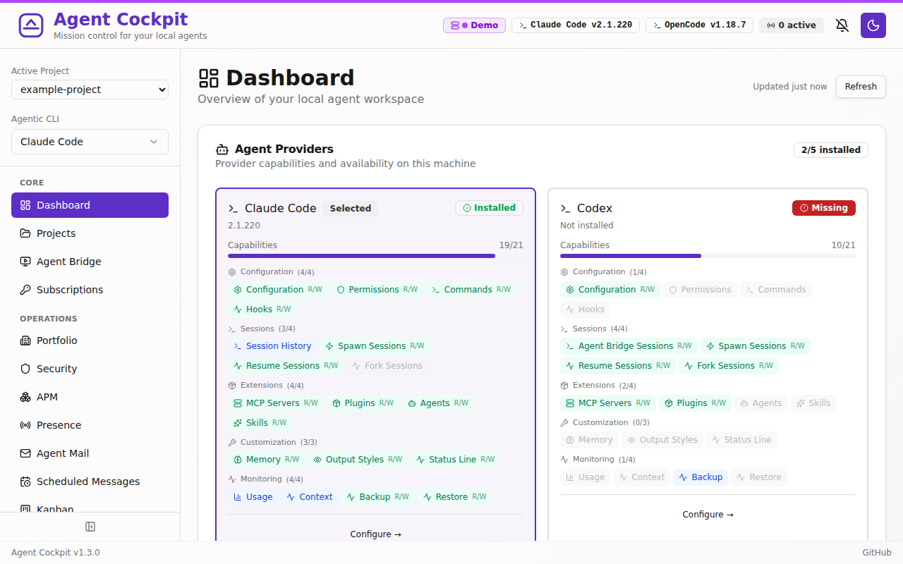
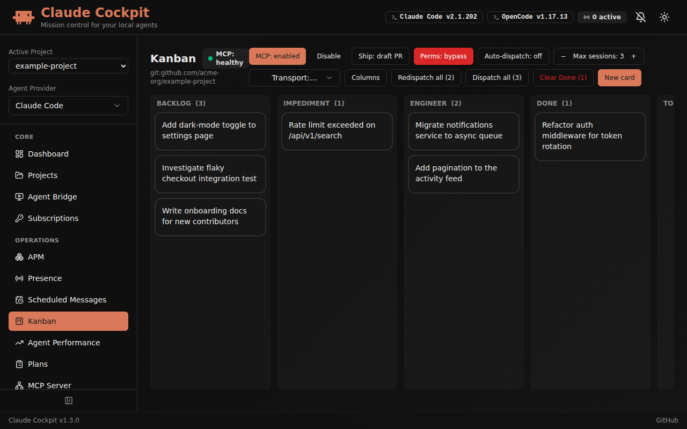
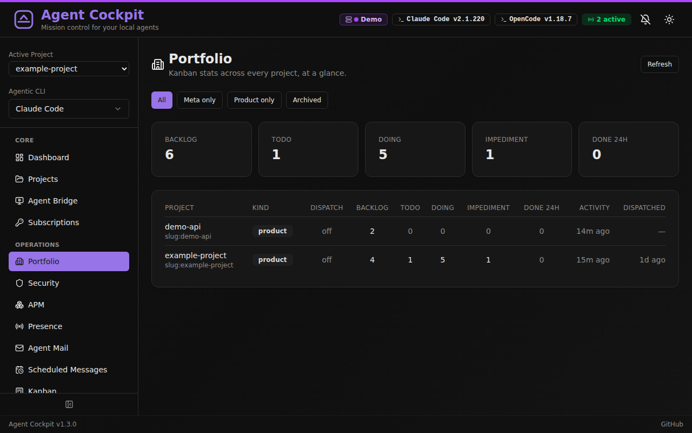
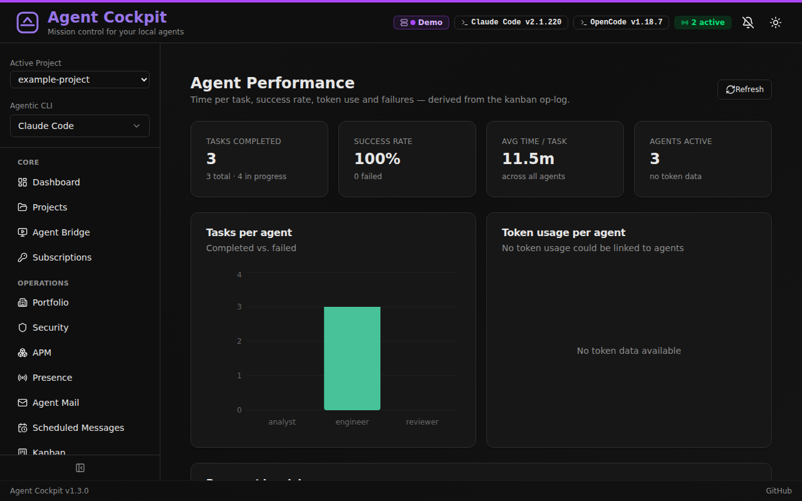
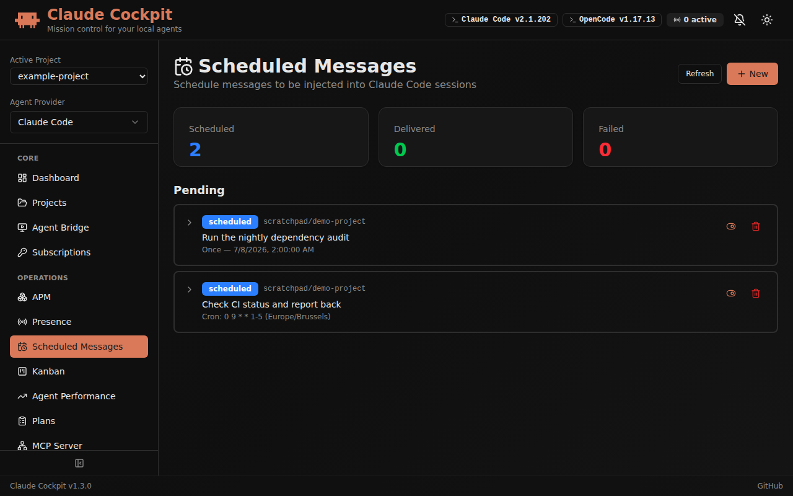
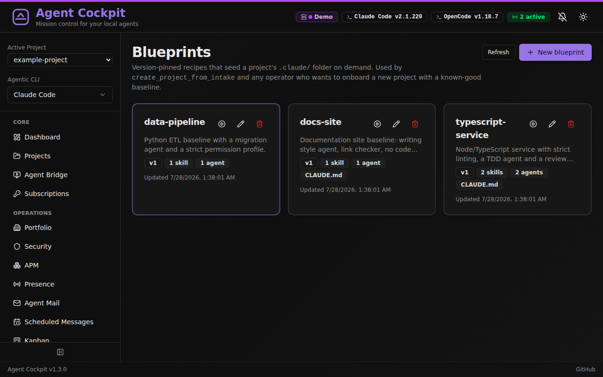
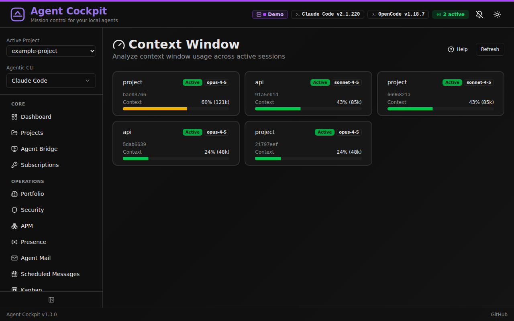
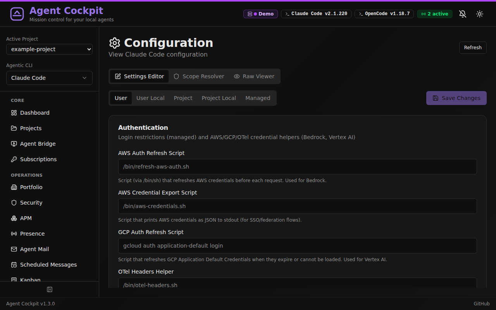

# Agent Cockpit

[](https://github.com/guillaumevandevelde/claude-cockpit/actions/workflows/quality.yml)
[](https://github.com/guillaumevandevelde/claude-cockpit/actions/workflows/security.yml)

<picture>
  <source media="(prefers-color-scheme: dark)" srcset="cockpit-rebrand-dark.png">
  <source media="(prefers-color-scheme: light)" srcset="cockpit-rebrand-light.png">
  
</picture>

A self-hosted web application for running and managing local AI coding agents. Two things live in one app:

1. **An agent work loop.** A kanban board where cards are dispatched to real agent sessions — the dispatcher claims a card, spawns an agent in its own git worktree, and the card moves across the board as the agent works, hands off, gets blocked, or ships. Larger cards can be split by an analyst agent into child cards with a dependency graph.
2. **A control panel for the agent CLIs themselves.** Configuration, MCP servers, plugins, slash commands, hooks, agents, skills, permissions, transcripts, usage and backups for Claude Code, Codex CLI, OpenCode, GitHub Copilot CLI and MiMoCode — reading and writing the same files those CLIs use.

Everything runs on your machine, against your real config files. No account, no cloud, no telemetry.

## Credits — Forked from claude-deck

Agent Cockpit is a fork of [**claude-deck**](https://github.com/adrirubio/claude-deck) by Adrian Rubio-Punal and Juan A. Rubio, used under the MIT License. Their original copyright and license are retained in [`LICENSE`](./LICENSE). claude-deck contributed the configuration, MCP, sessions, usage and Agent Bridge surfaces; Agent Cockpit adds the kanban dispatch loop, multi-agent decomposition, scheduled messages, sandboxed runs, and the multi-CLI provider layer on top.

## Why This Exists

Claude Code starts simple, then slowly sprawls across config files and directories: `~/.claude.json`, `~/.claude/settings.json`, `.mcp.json`, slash commands, agents, skills, project settings, transcripts, and usage data. That works fine at small scale, but once your setup gets serious it becomes hard to see the whole picture, change things confidently, or understand what is actually configured.

Running *several* agents at once adds a second problem on top of that one: which session is working on what, which one is stuck waiting for a human, what has already shipped, and what is blocked on something else. Terminal multiplexers answer none of that.

Agent Cockpit is one local interface for both — the configuration sprawl and the work in flight.

## Best For

People running multiple concurrent agent sessions, or a serious Claude Code / Codex CLI setup: several MCP servers, custom commands, hooks, agents, skills, and usage worth keeping an eye on.

If you use one agent casually with mostly default config, Agent Cockpit is overkill.

## Trust Model

- **Local only** — no cloud
- **No account** — nothing to sign up for
- **No telemetry** — no usage tracking sent anywhere
- **Works with your real files** — reads and writes existing agent configuration files

> [!WARNING]
> Agent Cockpit reads and writes your real local agent configuration files, and it can spawn agent sessions that write to your repositories. Changes made in the UI affect the files Claude Code and the other CLIs actually use. Review changes carefully, and create a backup before major edits.

## Features

### Running work

- **Kanban** — The board that drives the work loop. It has a fixed set of columns — `Backlog`, `Impediment`, `Awaiting Subtasks`, `Done` and `To Resume` — plus one column per agent, generated from the project's `.claude/agents/`. Auto-dispatch is opt-in per project: the poller claims a `Backlog` card, moves it into the target agent's column, and spawns that agent in a fresh git worktree. A card carries its own comments, deliverables (PR / branch / commit / link / note), labels, priority, work type, dependencies on other cards, and per-card model, provider or transport overrides. A blocked agent posts an impediment with a concrete question and candidate answers for a human to pick from.
- **Multi-agent decomposition** — A card that is too big for one session goes to an analyst agent, which splits it into child cards with an explicit dependency DAG and attaches the plan. Executor sessions only start once their dependencies are `Done`.
- **Agent Bridge** — Discover and observe agent sessions running in tmux, per CLI. Attach up to 4 terminals at once in a 2x2 grid, each independently read-only or interactive, with fullscreen, per-pane controls, and spawn / resume / fork / kill from the UI.
- **Scheduled Messages** — Queue a message for future delivery into a running (or resumable) session, as a one-shot timer or a recurring cron expression, with a choice of permission mode and what to do when the session is missing or busy. Includes auto-resume when a session hits its rate limit.
- **Sandcastle** — Run agents in isolated Docker or Podman containers via [sandcastle](https://github.com/mattpocock/sandcastle), with parallel runs, kanban integration and live log streaming.

### Overview and control

- **Dashboard** — Which agent CLIs are installed on this machine and what each one actually supports, as a per-capability matrix (read-only vs read/write), plus counts for projects, MCP servers, commands, plugins, hooks and permissions.
- **Portfolio** — Kanban totals across every tracked project at once: backlog, in progress, impediments, cards finished in the last 24h, dispatch on/off, and last activity.
- **Agent Performance** — Time per task, success rate, tasks completed per agent and common failure reasons, derived from the kanban operation log.
- **Subscriptions** — Credentials for launching sessions against alternate providers instead of the default vendor, plus the tokens each subscription consumed in the current rate window.
- **Projects** — Discover, add and switch projects, including a directory browser; the active project scopes most other pages.
- **Blueprints** — Version-pinned recipes that seed a new project's `.claude/` folder (settings, skills, agents, `CLAUDE.md`) so a new repository starts from a known-good baseline.
- **MCP Server** — Agent Cockpit's own MCP endpoint, so agents can read and drive the board, sessions and scheduled messages as tools. Includes the client config snippet and token management.
- **APM** — Per-project agent dependency management via an `apm.yml` manifest.
- **Updates** — One-click self-update with preflight checks.
- **Backup & Restore** — Create and manage backups with selective restore. Codex exports are redacted and export-only by design.

### Per-CLI configuration

Which of these appear depends on the CLI selected in the sidebar and on what that CLI actually supports — the capability matrix drives the navigation, so unsupported surfaces are hidden rather than shown broken.

- **Config** — Claude Code JSON settings across all five scopes (user, user-local, project, project-local, managed) with a form editor, a scope resolver that shows which file wins, and a raw viewer. For Codex: safe TOML settings, profiles, runtime options, and feature flags read from `codex features list`, with dropdowns for known enum values and tooltips where official descriptions exist.
- **MCP Servers** — Add, edit, test and manage MCP connections over stdio, HTTP and SSE, with OAuth support, plus browse and install from the [MCP Registry](https://registry.modelcontextprotocol.io). Inspect the tools, resources and prompts a server exposes.
- **Slash Commands** — Browse, create and edit custom commands at user and project scope.
- **Plugins** — Browse installed plugins with detail views and enable/disable toggles. Codex plugins support CLI-backed inventory, install and remove where the installed Codex CLI exposes safe commands.
- **Hooks** — Configure automation hooks per event type (PreToolUse, PostToolUse, Stop, Notification, SessionStart, …).
- **Permissions / Trust** — Visual allow / ask / deny rule builder for tool access, plus the default permission mode.
- **Agents** — Create and manage subagent definitions, including model and tool restrictions.
- **Skills** — Browse installed skills and discover new ones from [skills.sh](https://skills.sh), with usage stats.
- **Memory** — View and edit `CLAUDE.md` memory files at user and project scope.
- **Output Styles** and **Status Line** — Configure response formatting and the CLI status line.
- **Session Transcripts** — Browse conversation history per project with full message detail, tool calls and results.
- **Usage Tracking** — Token usage, cost and billing blocks with daily, monthly, per-session and per-block views, plus JSON/CSV export.
- **Context** — Context window usage per active session, including cache efficiency and what is filling the window.
- **Plans** — Browse and review the implementation plans an agent has written.

### Supported agent CLIs

| CLI | Status |
|-----|--------|
| Claude Code | Full surface — config, sessions, MCP, plugins, permissions, commands, hooks, agents, skills, memory, output styles, status line, usage, context, backup |
| Codex CLI | Config (TOML, profiles, feature flags), sessions, MCP and plugin inventory, redacted export-only backup. No transcript browsing or usage/context parity |
| OpenCode | Config, sessions, MCP, plugins, agents, skills, memory, commands, usage |
| GitHub Copilot CLI | Session discovery and spawning |
| MiMoCode | Config, skills, memory |

Codex support is explicit about its boundaries: history and model-cache diagnostics avoid prompt text and raw cache payloads, and automatic restore is refused because exports intentionally exclude auth, history, cache and local state.

## Screenshots

All screenshots are taken against a throwaway instance seeded with demo data (`example-project`, `demo-api`), not a real workspace.

| Dashboard | Kanban |
|-----------|--------|
|  |  |
| Installed CLIs and their capability matrix, plus configuration counts | Cards moving from Backlog through per-agent columns to Done, with dispatch controls |

| Portfolio | Agent Performance |
|-----------|-------------------|
|  |  |
| Board totals across every tracked project at a glance | Throughput, success rate and time per task per agent |

| Agent Bridge | Scheduled Messages |
|--------------|--------------------|
|  |  |
| Attach to a live tmux session, read-only or interactive | Timer and cron messages queued for delivery into a session |

| Blueprints | |
|------------|--|
|  | |
| Version-pinned recipes that seed a new project's `.claude/` | |

| Usage Tracking | Context |
|----------------|---------|
|  |  |
| Cost over time, per-model and per-session breakdowns | Context window pressure across active sessions |

| Session Transcripts | MCP Servers |
|---------------------|-------------|
|  |  |
| Conversation history with full tool-call detail | stdio, HTTP and SSE connections with per-server testing |

| Configuration | Skills |
|---------------|--------|
|  |  |
| Settings across all five scopes, with a resolver and raw viewer | Installed skills, plus discovery from skills.sh |

## Tech Stack

| Layer | Technology |
|-------|------------|
| Backend | Python 3.11+ with FastAPI |
| Frontend | React 19 + TypeScript 6 + Vite 7 |
| UI Components | shadcn/ui + Tailwind CSS |
| Charts | Recharts (via shadcn/ui) |
| Terminals | xterm.js over a WebSocket pty relay to tmux |
| Scheduling | APScheduler (dispatch poller, scheduled messages, stale detection) |
| Database | SQLite (async via SQLAlchemy + aiosqlite) |
| Containerization | Docker + Docker Compose |

Two SQLite stores are used deliberately: `backend/claude_registry.db` holds device-local state (MCP servers, commands, permissions, plugin state), and `~/.claude-registry/kanban.db` holds the kanban board so it stays portable and machine-scoped.

## Quick Start with Docker

```bash
git clone git@github.com:guillaumevandevelde/claude-cockpit.git
cd claude-cockpit
docker compose up
```

This builds and starts Agent Cockpit at http://localhost:8000, mounting your `~/.claude` directory and `~/.claude.json` configuration file. Codex support reads `$CODEX_HOME`, defaulting to `~/.codex`, when available in the runtime environment.

> [!WARNING]
> Agent Cockpit is not a mock viewer. It works with your real local agent files, so changes made in the UI can change your working setup.

> [!NOTE]
> The container mounts your home directory's Claude Code configuration. The container runs as root to access these files; adjust permissions if running as a non-root user.

## Manual Installation

**Prerequisites**: Python 3.11+, Node.js 18+. tmux is required for Agent Bridge, scheduled messages and kanban dispatch.

```bash
git clone git@github.com:guillaumevandevelde/claude-cockpit.git
cd claude-cockpit
./scripts/install.sh
```

## Development

**Recommended — supervised background:**

```bash
./scripts/cockpit.sh start          # Start, auto-install deps if needed, detach
./scripts/cockpit.sh logs backend   # Follow backend logs (or: logs frontend)
./scripts/cockpit.sh status         # Show service status
./scripts/cockpit.sh restart        # Restart after config changes
./scripts/cockpit.sh stop           # Stop everything
```

The supervisor auto-restarts crashed services and automatically runs `npm install` or `pip install` when `package-lock.json` or `requirements-dev.txt` change. It also survives terminal close.

**Alternative — attached mode:**

```bash
./scripts/dev.sh
```

All output appears directly in the terminal; Ctrl+C stops both servers. Useful for debugging startup issues. Requires deps to be installed first (`./scripts/install.sh` or a prior `cockpit.sh start`).

Both approaches start:
- Backend at http://localhost:8000 (API docs at http://localhost:8000/docs)
- Frontend at http://localhost:5173

To make the dev environment reachable from another machine on your LAN or tailnet, set an API token and pass `--host`:

```bash
API_TOKEN='replace-with-a-long-random-value' ./scripts/cockpit.sh start --host 0.0.0.0
# or
API_TOKEN='replace-with-a-long-random-value' ./scripts/dev.sh --host 0.0.0.0
```

Both servers will then bind to all interfaces. The browser asks for the API token on its first protected request and keeps it in session storage. Configure `CORS_ORIGINS` explicitly when using a reverse proxy or a different frontend origin.

### Naming an Agent Cockpit instance

When running Agent Cockpit on several machines, set a display name and accent color so each browser window clearly identifies the backend it controls:

```bash
CLAUDE_COCKPIT_INSTANCE_NAME="Studio Mac" \
CLAUDE_COCKPIT_INSTANCE_ACCENT="blue" \
./scripts/dev.sh --host 0.0.0.0
```

Supported accents are `blue`, `green`, `purple`, `orange`, `red`, `pink`, `cyan`, and `slate`. The name appears in the header, browser tab title, Agent Bridge terminal panes, and kill-session confirmations.

To preview the documentation site:

```bash
./scripts/docs-dev.sh
```

This starts VitePress at http://localhost:5174/docs/. Use `--host 0.0.0.0` if you need to reach it from another machine.

For a release check, `./scripts/build.sh` builds both the app frontend and the documentation site.

## Configuration Files

Agent Cockpit reads and writes these Claude Code configuration files:

| File/Directory | Scope | Description |
|---------------|-------|-------------|
| `~/.claude.json` | User | OAuth, caches, MCP servers |
| `~/.claude/settings.json` | User | User settings, permissions, disabled servers |
| `~/.claude/settings.local.json` | User | Local overrides (not committed) |
| `~/.claude/commands/` | User | User slash commands |
| `~/.claude/agents/` | User | User agents |
| `~/.claude/skills/` | User | User skills |
| `~/.claude/projects/` | User | Session transcripts & usage data |
| `.claude/settings.json` | Project | Project settings |
| `.claude/commands/` | Project | Project slash commands |
| `.claude/agents/` | Project | Project agents — these become the kanban board's agent columns |
| `.mcp.json` | Project | Project MCP servers |
| `CLAUDE.md` | Project | Project instructions |

Codex CLI support uses `$CODEX_HOME`, defaulting to `~/.codex`:

| File/Directory | Scope | Description |
|---------------|-------|-------------|
| `~/.codex/config.toml` | User | Main Codex TOML configuration |
| `~/.codex/*.config.toml` | User | Codex profile v2 files |
| `~/.codex/rules/` | User | Codex rule files |
| `~/.codex/auth.json` | User | Auth status only; raw contents are never returned |

Agent Cockpit's own state lives in `~/.claude-registry/` (kanban board, backups, attachments) and in `backend/claude_registry.db`.

## Contributing

See [CONTRIBUTING.md](CONTRIBUTING.md) for setup, style, and PR guidelines.

API documentation is available at http://localhost:8000/docs when running the dev server.

## Feedback

If you run agents heavily, issues and feature requests are especially welcome.

## Built By

[Adrian](https://github.com/adrirubio) (13) and [Juan](https://github.com/juanrubio) during the 2025 Christmas break as a learning project — to explore open source, Claude Code, and full-stack development together.

## Acknowledgments

The session transcript viewer was inspired by and includes code adapted from [claude-code-transcripts](https://github.com/simonw/claude-code-transcripts) by [Simon Willison](https://simonwillison.net/).

The usage tracking feature ports algorithms from [ccusage](https://github.com/ryoppippi/ccusage) by [ryoppippi](https://github.com/ryoppippi), including session block identification, tiered pricing, and burn rate projections.

The sandcastle integration uses [sandcastle](https://github.com/mattpocock/sandcastle) by [Matt Pocock](https://github.com/mattpocock) for orchestrating AI coding agents in isolated sandbox environments.

## Disclaimer

Agent Cockpit is a community project and is not affiliated with or endorsed by Anthropic.

## License

MIT License
